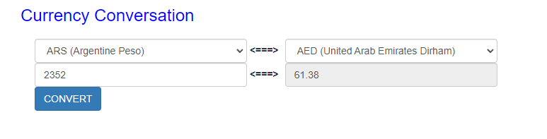

# Currency converter

## Description
It's a basic spring-boot application with simple user web interface:
For starting project you should call get request
http://localhost:8080/ or http://localhost:8080/index

The main purpose of service is currency rates converting.
For currency conversion you have to fill amount field with amount currency value.
Also, you should choose one currency from currency list at left side of web page,
and you should choose target currency at right side of page. 

After that click on "convert" button at downside of web page, and you can see result
at right side field.
The result of service work you can see on the picture below 

This service uses data rates API from web resource https://exchangeratesapi.io/. 
Data of this resource is always actual.

### Notices:
- you can't press non - numeric symbols at amount field
- if the connection with tps://exchangeratesapi.io/ service lose, you will see default rates data
- if you enter incorrect data in the amount field, you can see the error message on the page 